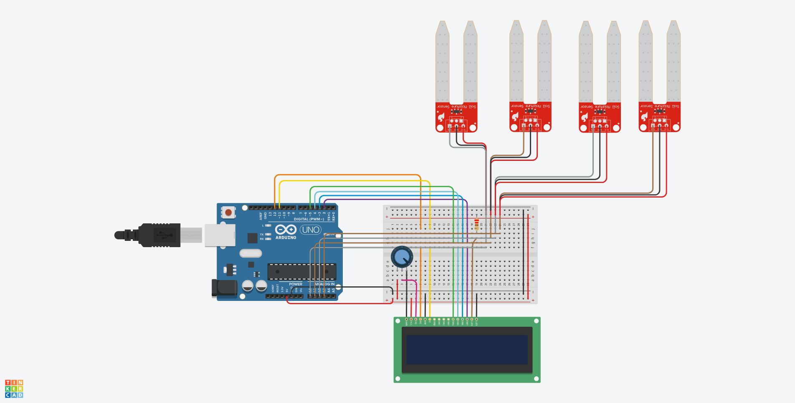

# Monitor de Umidade do Solo com Arduino

Este projeto consiste em um sistema de monitoramento de umidade do solo utilizando sensores analógicos e um display LCD 16x2, desenvolvido como **trabalho da disciplina de Programação de Microcontroladores**, no curso de **Ciência da Computação**.

A leitura da umidade é feita por quatro sensores conectados ao Arduino, e os dados são exibidos em tempo real no display LCD. A prototipação inicial foi realizada no ambiente virtual [Tinkercad](https://www.tinkercad.com/).

---

## Visão Geral

  
*Protótipo virtual do circuito montado no Tinkercad*

---

## Componentes Utilizados

- 4 sensores de umidade do solo
- 1 Arduino Uno R3 
- 1 display LCD 16x2
- 1 potenciômetro de 250 kΩ
- 1 resistor de 220 Ω

---

## Estrutura do Projeto
```
/monitor-umidade-solo
├── soil_moisture_display.ino   # Código principal em C++ (.ino)
├── docs/
│ ├── circuito_tinkercad.png    # Imagem do circuito no Tinkercad
│ └── modelagem_circuito.pdf    # Diagrama e modelagem do circuito
└── README.md
```

---

## Funcionamento

- Os sensores de umidade são lidos pelas portas analógicas A0 a A3.
- Os valores são convertidos em porcentagem de umidade com base em um intervalo calibrado.
- O resultado é exibido no LCD, com uma linha para os rótulos e outra com os valores atualizados.

---

## Código-fonte

Você pode visualizar e testar o código principal no arquivo [`soil_moisture_display.ino`](./soil_moisture_display.ino).

---

## Resultados Esperados

- Visualização em tempo real da umidade de até 4 regiões do solo.
- Facilidade de leitura para pessoas com pouca familiaridade técnica.
- Aplicabilidade em pequenos cultivos e hortas comunitárias.

---

## Licença

Este projeto foi desenvolvido para fins educacionais e está sob a licença MIT.
